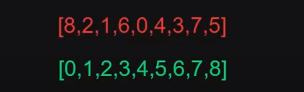
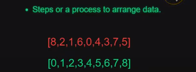
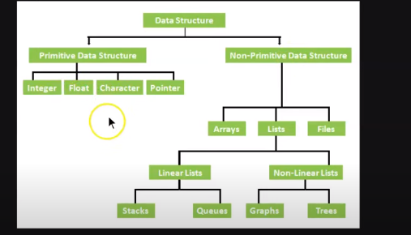
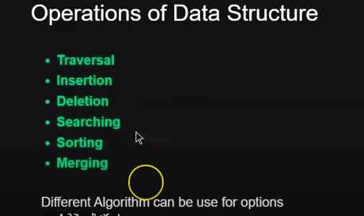

# DSA with JavaScript, what is Data structure ?

1. DSA stand for Data Structure AND Algorithms.
2. DSA is specific to data not to any programming language or company. For managing high amount of data we use Data Structure.
3. way to organize data so that we can use this data efficiently. Eaxmple:

 

4. What is Algorithms? 

5. DSA TYPES

 

6. linear mean operations can be perform in the start or end not in between
7. non linear means can be start from anywhere like tree node or graph.
8. DSA operations

9. Traversal means following it as whole like reading the whole array, Insertion if you want to insert new valuue , then deletion delete, searching for search, sorting for arranging, merging for merge the two value.

10. 
